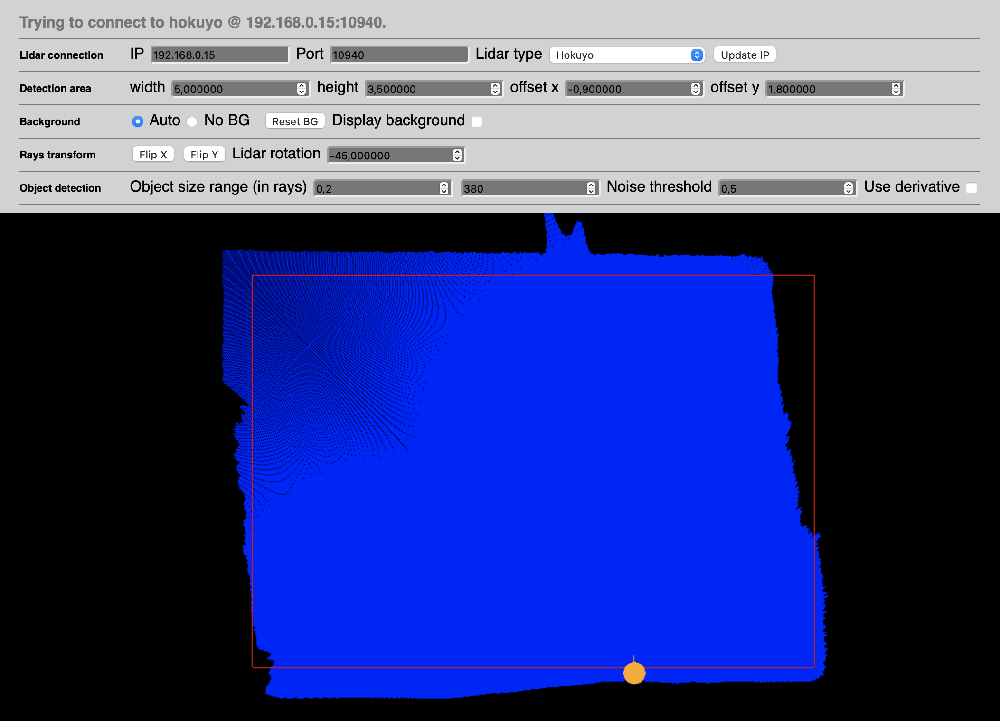

# Using Augmenta with TouchDesigner

**The goal is to create interactive installations using video mapping and the tracking system Augmenta with TouchDesigner. Augmenta allows you to track people and objects with 3D cameras or LiDAR, with data such as size (as a bounding box), position, velocity and orientation.**

The process will consists of using the basic TouchDesigner file already containing the Augmenta plugin connecting to Augmenta Fusion and using Augmenta data to instance 2D or 3D elements on TouchDesigner.

# Set up and Augmenta calibration

## Set up of the scene and projection

Open AugmentaFusion.

You need to know the size in meters of your scene (the size of the projection on the ground/wall), and set it up in the Inspector of the scene.

You can then output your Augmenta scene via Syphon or Spout on the projector (with the same resolution as your projector), to make sure the set up is correct.

If the set up is correct, the squares projected are actually squares.

If your connection works, you should see one source available in the `Sources` tab. Add it to see the source surface appear on the scene.

Right-click on the source to `Open Web Interface`.

## Web Interface

### 3D camera
XYZ position of points, calculated into bounding boxes around objects :

On the web interface, you can see the depth that the camera sees in greyscale, and adjust the parameters.

### Lidar
XY position of points :

Your network should be lidar > RJ45 > lan2 of the node > lan 1 of the node > RJ45 > lan 2  of the router > lan 1  of the router > computer.

<!-- (jsuis pas sure de l'ordre sur le routeur). -->

To have the right IP adress, you need to change your ethernet network parameters when you are connected to the router.
Change your IP adress from DHCP to manual, and choose 192.168.8.3(or anything from 192.168.8.3 to 192.168.8.254), subnet mask 255.255.0.0, and the router is at 192.168.8.1.

The source should be detected on AugmentaFusion, and you can then open the web interface. It will detect that you are using a Lidar, and you can open the Lidar interface.

On the web interface, you can connect to the lidar with the IP 192.168.0.15, on the port 10940, check out the output of what the lidar sees, and determine the size of the detection area in meters.
You can also select the minimum object size to be detected and the noise threshold.

## Calibration

Ask someone to enter the interaction area (touching the wall where the lidar is, stepping under the camera), you should see them appear on the source surface on the scene on AugmentaFusion.

Translate their point by dragging the source surface on the scene until it matches the position on the projection.

While holding alt, drag and drop the + anchor of the source surface to the point.

Ask the someone the move to the other side of the interaction area, and drag to rotate and scale the source surface until the point on the projection is on the new position.

Now when people move on the projection area, points should appear on their position.

<!-- ajouter un gif -->

# 2D instancing in TD

## project1

In the main project, there is the Augmenta base, where you set the OSC port to the one in Augmenta Fusion or in Augmenta Simulator. The outputs are the data coming from Augmenta, and a null showing the debug view.

There is also the **Top_with_Augmenta**, outputting the final visual.

## *project1 >* Top_with_Augmenta

In the Composite tab of the **Comp1**, the TOP selected is `Element_replicator/item*/output1` in order to get every output in every items inside the **Element_replicator**.

**Blur1** and **Level4** are used to create the metaballs effect like in [Benjamin Carrier's tutorial](https://www.youtube.com/watch?v=_8DY7myCNgk), with a Pre-Shrink between 1 and 5, and a Filter Size between 10 and 100 in the Blur, and a Brigthness between 1 and 3, and a Contrast between 10 and 80 in the Level.

**Feedback1** and **Level3** are used to create a motion blur, with `Comp3` as the Target TOP of the Feedback, and the Brightness set between 0 and 1 in the Level to change the lenght of the blur.

## *project1 > Top_with_Augmenta >* Element Replicator

In this case, there is 3 distinct objects detected by Augmenta.

If you open any of these items, they contain the same nodes that there are in `Master_Attractor0`, but with the data of one id each.

## *project1 > Top_with_Augmenta > Element Replicator >* Master Attractor

This is the node where the element that will be instanced for each object detected will be created, and Augmenta's datas will be assigned to TOPs parameters.

In this example, we select the position in x and y to assigned it to the circle, as well as the height to set the radius of the circle :

In the Output tab of the TOP (here : `circle1`), the toggle "Comp with Input" needs to be switched on, and in the Common tab, the resolution needs to be the same as the video projector used.